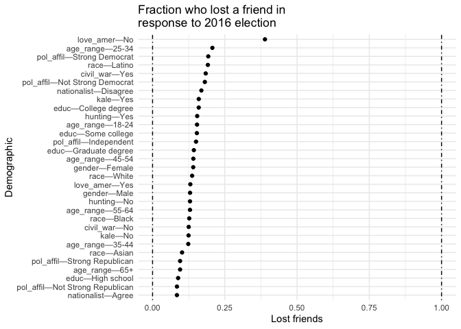
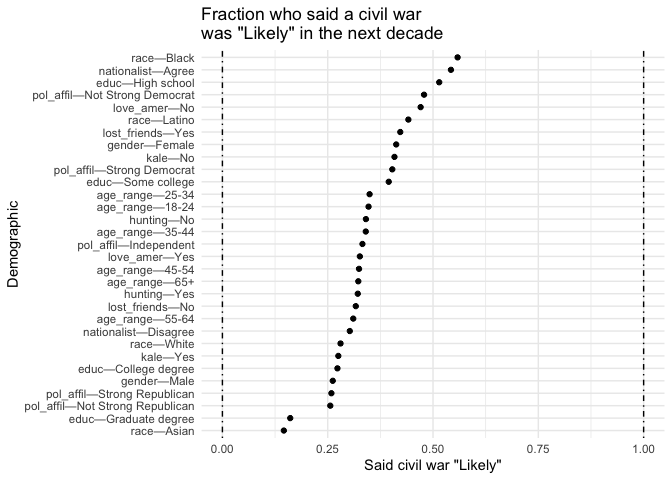
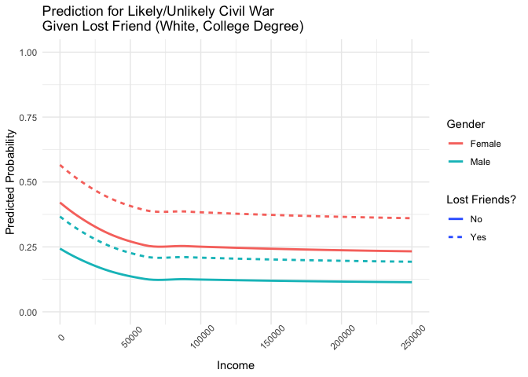
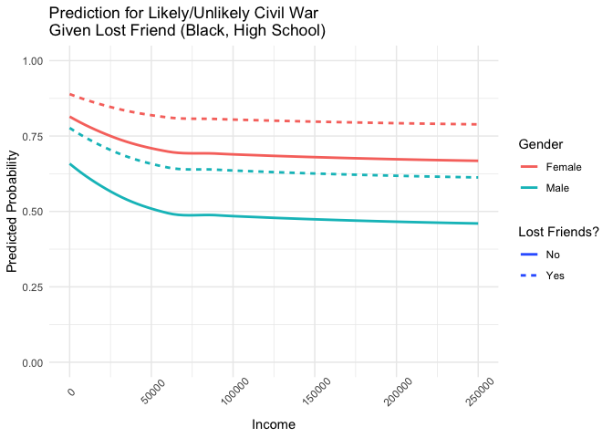
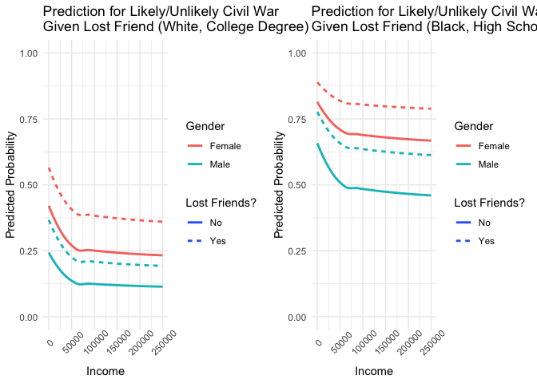
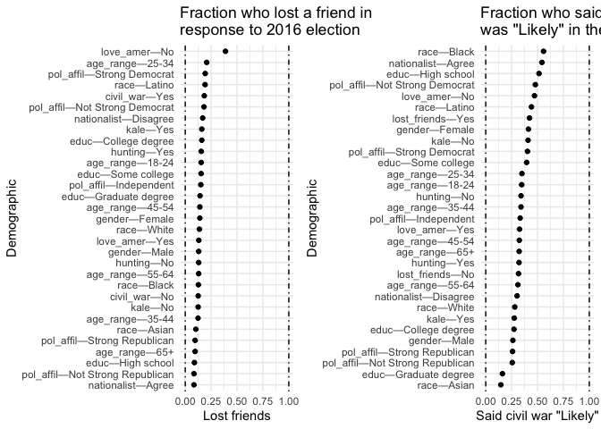

Cards against humanity paper notebook
================

### Read the data

``` r
df_raw = read_csv('/Users/georgeberry/Desktop/CAH/cah_data_files/201710-CAH_PulseOfTheNation_Raw.csv')
```

    ## Rows: 1000 Columns: 26
    ## ── Column specification ────────────────────────────────────────────────────────
    ## Delimiter: ","
    ## chr (20): Gender, Age Range, Political Affiliation, Do you approve or disapp...
    ## dbl  (6): Income, Age, If you had to guess, what percentage of Republicans w...
    ## 
    ## ℹ Use `spec()` to retrieve the full column specification for this data.
    ## ℹ Specify the column types or set `show_col_types = FALSE` to quiet this message.

### Clean the data

``` r
dep_var = 'civil_war'
indep_var = 'lost_friends'
control_vars = c(
  'income',
  'gender',
  'age',
  'age_range',
  'pol_affil',
  'race',
  'educ',
  'kale',
  'hunting',
  'nationalist',
  'love_amer'
)
all_vars = c(dep_var, indep_var, control_vars)
```

``` r
colnames(df_raw) = c(
  'income',
  'gender',
  'age',
  'age_range',
  'pol_affil',
  'approve',
  'educ',
  'blank1',
  'race',
  'blank2',
  'nationalist',
  'rep_nationalist',
  'blank3',
  'love_amer',
  'dem_love_amer',
  'blank4',
  'help_poor',
  'rep_help_poor',
  'white_racist',
  'dem_white_racist',
  'lost_friends',
  'civil_war',
  'hunting',
  'kale',
  'the_rock',
  'vader_or_trump'
)

df = df_raw %>%
  select(all_of(all_vars)) %>%
  mutate(across(everything(), ~ifelse(. == 'DK/REF', NA, .))) %>%
  mutate(
    civil_war = ifelse(civil_war == 'Likely', 1, 0),
    log_income = log1p(income),
    #income=income/1000,
  ) %>%
  mutate_if(is.character, as.factor) %>%
  mutate(
    gender=relevel(gender, 'Female'),
    age_range=relevel(age_range, '35-44'),
    pol_affil=relevel(pol_affil, 'Independent'),
    race=relevel(race, 'White'),
    educ=relevel(educ, 'High school'),
    kale=relevel(kale, 'No'),
    hunting=relevel(hunting, 'No'),
    nationalist=relevel(nationalist, 'Disagree'),
    love_amer=relevel(love_amer, 'No'),
    lost_friends=relevel(lost_friends, 'No')
  )
```

### Missingness structure

``` r
colSums(is.na(df))
```

    ##    civil_war lost_friends       income       gender          age    age_range 
    ##           63            8          700            7            0            0 
    ##    pol_affil         race         educ         kale      hunting  nationalist 
    ##          103           40            3           31            6          218 
    ##    love_amer   log_income 
    ##            8          700

``` r
colSums(
  is.na(
    df %>%
      select(-log_income)
  )
) -> missing_table
missing_table = as_tibble(as.data.frame(missing_table), rownames = 'Demographic') %>%
  rename(`Missing rows`=missing_table)
stargazer(missing_table, summary=F, rownames=F)
```

    ## 
    ## % Table created by stargazer v.5.2.3 by Marek Hlavac, Social Policy Institute. E-mail: marek.hlavac at gmail.com
    ## % Date and time: Tue, Jun 06, 2023 - 12:45:18
    ## \begin{table}[!htbp] \centering 
    ##   \caption{} 
    ##   \label{} 
    ## \begin{tabular}{@{\extracolsep{5pt}} cc} 
    ## \\[-1.8ex]\hline 
    ## \hline \\[-1.8ex] 
    ## Demographic & Missing rows \\ 
    ## \hline \\[-1.8ex] 
    ## civil\_war & 63 \\ 
    ## lost\_friends & 8 \\ 
    ## income & 700 \\ 
    ## gender & 7 \\ 
    ## age & 0 \\ 
    ## age\_range & 0 \\ 
    ## pol\_affil & 103 \\ 
    ## race & 40 \\ 
    ## educ & 3 \\ 
    ## kale & 31 \\ 
    ## hunting & 6 \\ 
    ## nationalist & 218 \\ 
    ## love\_amer & 8 \\ 
    ## \hline \\[-1.8ex] 
    ## \end{tabular} 
    ## \end{table}

### Examining lost friends

Overall

``` r
mean(df$lost_friends == 'Yes', na.rm=T)
```

    ## [1] 0.140121

Break down by demo

``` r
df %>%
  select(-income, -log_income, -age) %>%
  filter(!is.na(lost_friends)) %>%
  mutate(
    civil_war = ifelse(civil_war == 1, 'Yes', 'No')
  ) %>%
  pivot_longer(c(civil_war, gender:love_amer)) %>%
  mutate(
    lost_friends = ifelse(lost_friends == 'Yes', 1, 0),
  ) %>%
  filter(!is.na(value), value != 'Other') %>%
  group_by(name, value) %>%
  summarize(
    se = sd(lost_friends, na.rm=T) / sqrt(n()),
    lost_friends = mean(lost_friends),
    N=n()
  ) %>%
  mutate(
    demo = paste0(name, '—', value)
  ) %>%
  arrange(demo) -> lost_friends_demos
```

    ## `summarise()` has grouped output by 'name'. You can override using the
    ## `.groups` argument.

``` r
lost_friends_demos
```

    ## # A tibble: 31 × 6
    ## # Groups:   name [10]
    ##    name      value               se lost_friends     N demo                
    ##    <chr>     <chr>            <dbl>        <dbl> <int> <chr>               
    ##  1 age_range 18-24           0.0356       0.154    104 age_range—18-24     
    ##  2 age_range 25-34           0.0308       0.207    174 age_range—25-34     
    ##  3 age_range 35-44           0.0208       0.124    251 age_range—35-44     
    ##  4 age_range 45-54           0.0280       0.141    156 age_range—45-54     
    ##  5 age_range 55-64           0.0286       0.129    139 age_range—55-64     
    ##  6 age_range 65+             0.0227       0.0952   168 age_range—65+       
    ##  7 civil_war No              0.0132       0.125    624 civil_war—No        
    ##  8 civil_war Yes             0.0220       0.184    310 civil_war—Yes       
    ##  9 educ      College degree  0.0216       0.160    288 educ—College degree 
    ## 10 educ      Graduate degree 0.0238       0.143    217 educ—Graduate degree
    ## # … with 21 more rows

``` r
plot_lost_friends = ggplot(lost_friends_demos) +
  geom_point() +
  aes(x=reorder(demo, lost_friends), y=lost_friends) +
  geom_hline(yintercept=0, linetype='dotdash') +
  geom_hline(yintercept=1, linetype='dotdash') +
  ylim(c(0, 1)) +
  labs(
    title='Fraction who lost a friend in\nresponse to 2016 election',
    y='Lost friends',
    x='Demographic'
  ) +
  coord_flip() +
  theme_minimal()
plot_lost_friends
```

<!-- -->

Friendship loss is high for the 25-34 age group and for non-Republicans

### Examining perceptions of civil war

Overall

``` r
mean(df$civil_war, na.rm=T)
```

    ## [1] 0.3329776

Wow! 1/3 of Americans think a civil war is “Likely”. That’s a pretty
high level of fear.

Break down by demo

``` r
df %>%
  select(-income, -log_income, -age) %>%
  filter(!is.na(civil_war)) %>%
  pivot_longer(lost_friends:love_amer) %>%
  filter(!is.na(value), value != 'Other') %>%
  group_by(name, value) %>%
  summarize(
    se = sd(civil_war, na.rm=T) / sqrt(n()),
    civil_war = mean(civil_war),
    N=n()
  ) %>%
  mutate(
    demo = paste0(name, '—', value)
  ) %>%
  arrange(demo) -> civil_war_demos
```

    ## `summarise()` has grouped output by 'name'. You can override using the
    ## `.groups` argument.

``` r
civil_war_demos
```

    ## # A tibble: 31 × 6
    ## # Groups:   name [10]
    ##    name      value               se civil_war     N demo                
    ##    <chr>     <fct>            <dbl>     <dbl> <int> <chr>               
    ##  1 age_range 18-24           0.0483     0.347    98 age_range—18-24     
    ##  2 age_range 25-34           0.0371     0.349   166 age_range—25-34     
    ##  3 age_range 35-44           0.0308     0.340   238 age_range—35-44     
    ##  4 age_range 45-54           0.0386     0.324   148 age_range—45-54     
    ##  5 age_range 55-64           0.0404     0.311   132 age_range—55-64     
    ##  6 age_range 65+             0.0377     0.323   155 age_range—65+       
    ##  7 educ      College degree  0.0271     0.273   271 educ—College degree 
    ##  8 educ      Graduate degree 0.0257     0.161   205 educ—Graduate degree
    ##  9 educ      High school     0.0351     0.515   204 educ—High school    
    ## 10 educ      Some college    0.0321     0.395   233 educ—Some college   
    ## # … with 21 more rows

Super interesting: the people who lost friends are different than the
people who think a civil war is likely in the oneway! For instance the
education pattern is reversed.

``` r
plot_civil_war = ggplot(civil_war_demos) +
  geom_point() +
  aes(x=reorder(demo, civil_war), y=civil_war) +
  geom_hline(yintercept=0, linetype='dotdash') +
  geom_hline(yintercept=1, linetype='dotdash') +
  ylim(c(0, 1)) +
  labs(
    title='Fraction who said a civil war\nwas "Likely" in the next decade',
    y='Said civil war "Likely"',
    x='Demographic'
  ) +
  coord_flip() +
  theme_minimal()
plot_civil_war
```

<!-- -->

### Impute and regress

Note the following

- We do not use the DV `civil_war` as part of imputation
- We drop rows in the regression where the main independent variable
  `lost_friends` is missing

drop cases where DV is null, impute, and regress

``` r
df_no_dv = df %>% select(-civil_war)

imp_no_dv = mice(df_no_dv, m=5, maxit=50, meth='pmm', seed=500, printFlag=FALSE)
df_imp_no_dv = complete(imp_no_dv, 1)

df2 = df_imp_no_dv
df2$civil_war = df$civil_war
df2 = df2[!is.na(df$lost_friends),]
```

After accounting for both demos and some lifestyle questions, people who
lost friends as a result of the 2016 election are 12 percentage points
more likely to view a civil war as “Likely”. That’s large!

``` r
mod2 = lm(
  civil_war ~ lost_friends + log1p(income) + gender + age_range + pol_affil + race + educ + kale + hunting + nationalist + love_amer,
  data=df2
)
summary(mod2)
```

    ## 
    ## Call:
    ## lm(formula = civil_war ~ lost_friends + log1p(income) + gender + 
    ##     age_range + pol_affil + race + educ + kale + hunting + nationalist + 
    ##     love_amer, data = df2)
    ## 
    ## Residuals:
    ##     Min      1Q  Median      3Q     Max 
    ## -0.9685 -0.3226 -0.1533  0.4064  1.0218 
    ## 
    ## Coefficients:
    ##                                 Estimate Std. Error t value Pr(>|t|)    
    ## (Intercept)                     0.899286   0.263346   3.415 0.000666 ***
    ## lost_friendsYes                 0.120088   0.042533   2.823 0.004855 ** 
    ## log1p(income)                  -0.024351   0.024011  -1.014 0.310765    
    ## genderMale                     -0.157762   0.030807  -5.121 3.71e-07 ***
    ## genderOther                    -0.084568   0.095878  -0.882 0.377988    
    ## age_range18-24                 -0.090863   0.056136  -1.619 0.105877    
    ## age_range25-34                 -0.046225   0.046241  -1.000 0.317747    
    ## age_range45-54                 -0.076416   0.046788  -1.633 0.102764    
    ## age_range55-64                 -0.083019   0.050173  -1.655 0.098342 .  
    ## age_range65+                   -0.083103   0.046041  -1.805 0.071409 .  
    ## pol_affilNot Strong Democrat    0.117824   0.049194   2.395 0.016818 *  
    ## pol_affilNot Strong Republican -0.008406   0.052137  -0.161 0.871943    
    ## pol_affilStrong Democrat        0.025907   0.041441   0.625 0.532028    
    ## pol_affilStrong Republican     -0.019155   0.044598  -0.429 0.667665    
    ## raceAsian                      -0.135778   0.070756  -1.919 0.055303 .  
    ## raceBlack                       0.220987   0.046222   4.781 2.03e-06 ***
    ## raceLatino                      0.068663   0.048603   1.413 0.158080    
    ## raceOther                       0.099783   0.077683   1.284 0.199299    
    ## educCollege degree             -0.166277   0.045818  -3.629 0.000300 ***
    ## educGraduate degree            -0.247981   0.051107  -4.852 1.44e-06 ***
    ## educOther                      -0.269552   0.105409  -2.557 0.010713 *  
    ## educSome college               -0.075294   0.043747  -1.721 0.085567 .  
    ## kaleYes                        -0.068452   0.034322  -1.994 0.046404 *  
    ## huntingYes                      0.061261   0.032642   1.877 0.060872 .  
    ## nationalistAgree                0.150223   0.045802   3.280 0.001078 ** 
    ## love_amerYes                   -0.120463   0.077404  -1.556 0.119988    
    ## ---
    ## Signif. codes:  0 '***' 0.001 '**' 0.01 '*' 0.05 '.' 0.1 ' ' 1
    ## 
    ## Residual standard error: 0.4346 on 908 degrees of freedom
    ##   (58 observations deleted due to missingness)
    ## Multiple R-squared:  0.1719, Adjusted R-squared:  0.1491 
    ## F-statistic: 7.538 on 25 and 908 DF,  p-value: < 2.2e-16

We are imputing 70% of income so let’s check a model without income to
make sure we get similar results

``` r
df_no_inc = df %>% select(-civil_war, -income, -log_income)

imp_no_inc = mice(df_no_inc, m=5, maxit=50, meth='pmm', seed=500, printFlag=FALSE)
df_imp_no_inc = complete(imp_no_inc, 1)

df3 = df_imp_no_inc
df3$civil_war = df$civil_war
df3 = df3[!is.na(df$lost_friends),]
```

Interesting, the lifestyle variables matter here!

``` r
mod3 = lm(
  civil_war ~ lost_friends + gender + age_range + pol_affil + race + educ + kale + hunting + nationalist + love_amer,
  data=df3
)
summary(mod3)
```

    ## 
    ## Call:
    ## lm(formula = civil_war ~ lost_friends + gender + age_range + 
    ##     pol_affil + race + educ + kale + hunting + nationalist + 
    ##     love_amer, data = df3)
    ## 
    ## Residuals:
    ##     Min      1Q  Median      3Q     Max 
    ## -0.8998 -0.3286 -0.1588  0.4254  1.0862 
    ## 
    ## Coefficients:
    ##                                 Estimate Std. Error t value Pr(>|t|)    
    ## (Intercept)                     0.653611   0.089792   7.279 7.27e-13 ***
    ## lost_friendsYes                 0.108746   0.042024   2.588  0.00982 ** 
    ## genderMale                     -0.156862   0.030940  -5.070 4.83e-07 ***
    ## genderOther                    -0.075636   0.095918  -0.789  0.43058    
    ## age_range18-24                 -0.077323   0.054778  -1.412  0.15842    
    ## age_range25-34                 -0.034465   0.045039  -0.765  0.44433    
    ## age_range45-54                 -0.071981   0.046477  -1.549  0.12179    
    ## age_range55-64                 -0.075564   0.048259  -1.566  0.11774    
    ## age_range65+                   -0.078811   0.046308  -1.702  0.08912 .  
    ## pol_affilNot Strong Democrat    0.115321   0.049193   2.344  0.01928 *  
    ## pol_affilNot Strong Republican -0.016205   0.052665  -0.308  0.75838    
    ## pol_affilStrong Democrat        0.002233   0.040346   0.055  0.95587    
    ## pol_affilStrong Republican     -0.034322   0.042824  -0.801  0.42307    
    ## raceAsian                      -0.103340   0.067293  -1.536  0.12497    
    ## raceBlack                       0.234456   0.045727   5.127 3.59e-07 ***
    ## raceLatino                      0.081378   0.047053   1.730  0.08406 .  
    ## raceOther                       0.109674   0.077480   1.416  0.15726    
    ## educCollege degree             -0.192818   0.043991  -4.383 1.31e-05 ***
    ## educGraduate degree            -0.279355   0.047075  -5.934 4.19e-09 ***
    ## educOther                      -0.247851   0.101821  -2.434  0.01512 *  
    ## educSome college               -0.079417   0.043941  -1.807  0.07104 .  
    ## kaleYes                        -0.072036   0.030118  -2.392  0.01697 *  
    ## huntingYes                      0.064037   0.031887   2.008  0.04491 *  
    ## nationalistAgree                0.127890   0.044320   2.886  0.00400 ** 
    ## love_amerYes                   -0.118432   0.077867  -1.521  0.12862    
    ## ---
    ## Signif. codes:  0 '***' 0.001 '**' 0.01 '*' 0.05 '.' 0.1 ' ' 1
    ## 
    ## Residual standard error: 0.4362 on 909 degrees of freedom
    ##   (58 observations deleted due to missingness)
    ## Multiple R-squared:  0.1649, Adjusted R-squared:  0.1429 
    ## F-statistic: 7.481 on 24 and 909 DF,  p-value: < 2.2e-16

And just out of curiosity, what’s the raw regression say?

``` r
mod2_raw = lm(
  civil_war ~ lost_friends,
  data=df2
)
summary(mod2_raw)
```

    ## 
    ## Call:
    ## lm(formula = civil_war ~ lost_friends, data = df2)
    ## 
    ## Residuals:
    ##     Min      1Q  Median      3Q     Max 
    ## -0.4222 -0.3166 -0.3166  0.6834  0.6834 
    ## 
    ## Coefficients:
    ##                 Estimate Std. Error t value Pr(>|t|)    
    ## (Intercept)      0.31665    0.01663  19.046   <2e-16 ***
    ## lost_friendsYes  0.10558    0.04373   2.414    0.016 *  
    ## ---
    ## Signif. codes:  0 '***' 0.001 '**' 0.01 '*' 0.05 '.' 0.1 ' ' 1
    ## 
    ## Residual standard error: 0.4699 on 932 degrees of freedom
    ##   (58 observations deleted due to missingness)
    ## Multiple R-squared:  0.006215,   Adjusted R-squared:  0.005149 
    ## F-statistic: 5.829 on 1 and 932 DF,  p-value: 0.01596

And finally, let’s do imputation excluding the indep var (`lost_frends`)
from imputation. This is a check that matters if we interpret losing
friends causally.

``` r
df_no_dviv = df %>% select(-civil_war, -lost_friends)

imp_no_dviv = mice(df_no_dviv, m=5, maxit=50, meth='pmm', seed=500, printFlag=FALSE)
df_imp_no_dviv = complete(imp_no_dviv, 1)

df4 = df_imp_no_dviv
df4$civil_war = df$civil_war
df4$lost_friends = df$lost_friends
df4 = df4[!is.na(df$lost_friends),]
```

``` r
mod4 = lm(
  civil_war ~ lost_friends + log1p(income) + gender + age_range + pol_affil + race + educ + kale + hunting + nationalist + love_amer,
  data=df4
)
summary(mod4)
```

    ## 
    ## Call:
    ## lm(formula = civil_war ~ lost_friends + log1p(income) + gender + 
    ##     age_range + pol_affil + race + educ + kale + hunting + nationalist + 
    ##     love_amer, data = df4)
    ## 
    ## Residuals:
    ##     Min      1Q  Median      3Q     Max 
    ## -1.0108 -0.3196 -0.1444  0.4063  1.1034 
    ## 
    ## Coefficients:
    ##                                 Estimate Std. Error t value Pr(>|t|)    
    ## (Intercept)                     1.223749   0.265109   4.616 4.47e-06 ***
    ## lost_friendsYes                 0.122370   0.041723   2.933 0.003442 ** 
    ## log1p(income)                  -0.055310   0.023494  -2.354 0.018775 *  
    ## genderMale                     -0.155072   0.030617  -5.065 4.95e-07 ***
    ## genderOther                    -0.073450   0.095657  -0.768 0.442779    
    ## age_range18-24                 -0.090144   0.054489  -1.654 0.098400 .  
    ## age_range25-34                 -0.055977   0.045505  -1.230 0.218969    
    ## age_range45-54                 -0.089412   0.046666  -1.916 0.055680 .  
    ## age_range55-64                 -0.127477   0.051724  -2.465 0.013903 *  
    ## age_range65+                   -0.101658   0.046290  -2.196 0.028338 *  
    ## pol_affilNot Strong Democrat    0.144115   0.050328   2.864 0.004286 ** 
    ## pol_affilNot Strong Republican  0.002545   0.051468   0.049 0.960572    
    ## pol_affilStrong Democrat        0.036527   0.041042   0.890 0.373705    
    ## pol_affilStrong Republican     -0.019618   0.043278  -0.453 0.650433    
    ## raceAsian                      -0.151217   0.067300  -2.247 0.024886 *  
    ## raceBlack                       0.204910   0.046006   4.454 9.48e-06 ***
    ## raceLatino                      0.060144   0.046741   1.287 0.198508    
    ## raceOther                       0.115276   0.076915   1.499 0.134286    
    ## educCollege degree             -0.157513   0.045318  -3.476 0.000534 ***
    ## educGraduate degree            -0.224295   0.051259  -4.376 1.35e-05 ***
    ## educOther                      -0.260176   0.106765  -2.437 0.015005 *  
    ## educSome college               -0.074844   0.043334  -1.727 0.084487 .  
    ## kaleYes                        -0.060664   0.030676  -1.978 0.048281 *  
    ## huntingYes                      0.065820   0.031536   2.087 0.037154 *  
    ## nationalistAgree                0.129176   0.050435   2.561 0.010590 *  
    ## love_amerYes                   -0.112511   0.078025  -1.442 0.149650    
    ## ---
    ## Signif. codes:  0 '***' 0.001 '**' 0.01 '*' 0.05 '.' 0.1 ' ' 1
    ## 
    ## Residual standard error: 0.4326 on 908 degrees of freedom
    ##   (58 observations deleted due to missingness)
    ## Multiple R-squared:  0.1796, Adjusted R-squared:  0.157 
    ## F-statistic:  7.95 on 25 and 908 DF,  p-value: < 2.2e-16

Just curious: what if we drop the lifestyle questions or do only
lifestyle

``` r
summary(
  lm(
    civil_war ~ lost_friends + kale + hunting + nationalist + love_amer,
    data=df2
  )
)
```

    ## 
    ## Call:
    ## lm(formula = civil_war ~ lost_friends + kale + hunting + nationalist + 
    ##     love_amer, data = df2)
    ## 
    ## Residuals:
    ##     Min      1Q  Median      3Q     Max 
    ## -0.6661 -0.3481 -0.2269  0.5311  0.7742 
    ## 
    ## Coefficients:
    ##                   Estimate Std. Error t value Pr(>|t|)    
    ## (Intercept)       0.488847   0.081487   5.999 2.84e-09 ***
    ## lost_friendsYes   0.120797   0.043549   2.774  0.00565 ** 
    ## kaleYes          -0.122395   0.030546  -4.007 6.64e-05 ***
    ## huntingYes        0.001134   0.030804   0.037  0.97065    
    ## nationalistAgree  0.196050   0.044962   4.360 1.44e-05 ***
    ## love_amerYes     -0.140707   0.080452  -1.749  0.08063 .  
    ## ---
    ## Signif. codes:  0 '***' 0.001 '**' 0.01 '*' 0.05 '.' 0.1 ' ' 1
    ## 
    ## Residual standard error: 0.4608 on 928 degrees of freedom
    ##   (58 observations deleted due to missingness)
    ## Multiple R-squared:  0.0487, Adjusted R-squared:  0.04357 
    ## F-statistic: 9.501 on 5 and 928 DF,  p-value: 7.515e-09

``` r
summary(
  lm(
    civil_war ~ lost_friends + log1p(income) + gender + age_range + pol_affil + race + educ,
    data=df2
  )
)
```

    ## 
    ## Call:
    ## lm(formula = civil_war ~ lost_friends + log1p(income) + gender + 
    ##     age_range + pol_affil + race + educ, data = df2)
    ## 
    ## Residuals:
    ##     Min      1Q  Median      3Q     Max 
    ## -0.9291 -0.3169 -0.1552  0.4188  1.1213 
    ## 
    ## Coefficients:
    ##                                 Estimate Std. Error t value Pr(>|t|)    
    ## (Intercept)                     1.244922   0.217823   5.715 1.48e-08 ***
    ## lost_friendsYes                 0.131336   0.042160   3.115  0.00190 ** 
    ## log1p(income)                  -0.065203   0.020392  -3.197  0.00143 ** 
    ## genderMale                     -0.141361   0.029651  -4.768 2.17e-06 ***
    ## genderOther                    -0.078290   0.096059  -0.815  0.41528    
    ## age_range18-24                 -0.113091   0.055688  -2.031  0.04257 *  
    ## age_range25-34                 -0.059875   0.046367  -1.291  0.19692    
    ## age_range45-54                 -0.091224   0.046899  -1.945  0.05207 .  
    ## age_range55-64                 -0.116363   0.049702  -2.341  0.01944 *  
    ## age_range65+                   -0.078502   0.046291  -1.696  0.09025 .  
    ## pol_affilNot Strong Democrat    0.124421   0.049086   2.535  0.01142 *  
    ## pol_affilNot Strong Republican -0.003202   0.052391  -0.061  0.95128    
    ## pol_affilStrong Democrat        0.041294   0.041417   0.997  0.31901    
    ## pol_affilStrong Republican      0.006570   0.044197   0.149  0.88186    
    ## raceAsian                      -0.161956   0.069982  -2.314  0.02088 *  
    ## raceBlack                       0.198261   0.045782   4.331 1.65e-05 ***
    ## raceLatino                      0.038423   0.047683   0.806  0.42057    
    ## raceOther                       0.091551   0.078191   1.171  0.24196    
    ## educCollege degree             -0.185228   0.045350  -4.084 4.81e-05 ***
    ## educGraduate degree            -0.263591   0.050984  -5.170 2.88e-07 ***
    ## educOther                      -0.227191   0.104967  -2.164  0.03069 *  
    ## educSome college               -0.097300   0.043295  -2.247  0.02486 *  
    ## ---
    ## Signif. codes:  0 '***' 0.001 '**' 0.01 '*' 0.05 '.' 0.1 ' ' 1
    ## 
    ## Residual standard error: 0.4379 on 912 degrees of freedom
    ##   (58 observations deleted due to missingness)
    ## Multiple R-squared:  0.1558, Adjusted R-squared:  0.1363 
    ## F-statistic: 8.012 on 21 and 912 DF,  p-value: < 2.2e-16

### Now do logits or else people will (wrongly) complain

``` r
mod2_logit = glm(
  civil_war ~ lost_friends + log1p(income) + gender + age_range + pol_affil + race + educ + kale + hunting + nationalist + love_amer,
  data=df2,
  family=binomial
)
summary(mod2_logit)
```

    ## 
    ## Call:
    ## glm(formula = civil_war ~ lost_friends + log1p(income) + gender + 
    ##     age_range + pol_affil + race + educ + kale + hunting + nationalist + 
    ##     love_amer, family = binomial, data = df2)
    ## 
    ## Deviance Residuals: 
    ##     Min       1Q   Median       3Q      Max  
    ## -2.2220  -0.8418  -0.5571   0.9688   2.4657  
    ## 
    ## Coefficients:
    ##                                Estimate Std. Error z value Pr(>|z|)    
    ## (Intercept)                     1.97888    1.37913   1.435  0.15132    
    ## lost_friendsYes                 0.61861    0.21924   2.822  0.00478 ** 
    ## log1p(income)                  -0.10943    0.12583  -0.870  0.38449    
    ## genderMale                     -0.85833    0.16962  -5.060 4.19e-07 ***
    ## genderOther                    -0.40056    0.50379  -0.795  0.42656    
    ## age_range18-24                 -0.48234    0.30028  -1.606  0.10820    
    ## age_range25-34                 -0.27755    0.24805  -1.119  0.26317    
    ## age_range45-54                 -0.43835    0.25411  -1.725  0.08452 .  
    ## age_range55-64                 -0.42007    0.27053  -1.553  0.12048    
    ## age_range65+                   -0.50504    0.25415  -1.987  0.04690 *  
    ## pol_affilNot Strong Democrat    0.56216    0.25527   2.202  0.02765 *  
    ## pol_affilNot Strong Republican -0.03945    0.28815  -0.137  0.89110    
    ## pol_affilStrong Democrat        0.11440    0.21909   0.522  0.60155    
    ## pol_affilStrong Republican     -0.15421    0.24899  -0.619  0.53569    
    ## raceAsian                      -0.86731    0.45948  -1.888  0.05908 .  
    ## raceBlack                       1.08069    0.23729   4.554 5.26e-06 ***
    ## raceLatino                      0.34499    0.24703   1.397  0.16255    
    ## raceOther                       0.50747    0.40056   1.267  0.20520    
    ## educCollege degree             -0.80978    0.23501  -3.446  0.00057 ***
    ## educGraduate degree            -1.37060    0.28442  -4.819 1.44e-06 ***
    ## educOther                      -1.37392    0.58359  -2.354  0.01856 *  
    ## educSome college               -0.34676    0.21800  -1.591  0.11169    
    ## kaleYes                        -0.38507    0.18408  -2.092  0.03645 *  
    ## huntingYes                      0.37328    0.17852   2.091  0.03653 *  
    ## nationalistAgree                0.75450    0.23309   3.237  0.00121 ** 
    ## love_amerYes                   -0.61628    0.40094  -1.537  0.12428    
    ## ---
    ## Signif. codes:  0 '***' 0.001 '**' 0.01 '*' 0.05 '.' 0.1 ' ' 1
    ## 
    ## (Dispersion parameter for binomial family taken to be 1)
    ## 
    ##     Null deviance: 1187.2  on 933  degrees of freedom
    ## Residual deviance: 1015.9  on 908  degrees of freedom
    ##   (58 observations deleted due to missingness)
    ## AIC: 1067.9
    ## 
    ## Number of Fisher Scoring iterations: 4

``` r
mod3_logit = glm(
  civil_war ~ lost_friends + gender + age_range + pol_affil + race + educ + kale + hunting + nationalist + love_amer,
  data=df3, 
  family=binomial
)
summary(mod3_logit)
```

    ## 
    ## Call:
    ## glm(formula = civil_war ~ lost_friends + gender + age_range + 
    ##     pol_affil + race + educ + kale + hunting + nationalist + 
    ##     love_amer, family = binomial, data = df3)
    ## 
    ## Deviance Residuals: 
    ##     Min       1Q   Median       3Q      Max  
    ## -2.0758  -0.8497  -0.5699   0.9983   2.5357  
    ## 
    ## Coefficients:
    ##                                  Estimate Std. Error z value Pr(>|z|)    
    ## (Intercept)                     0.8678738  0.4613845   1.881  0.05997 .  
    ## lost_friendsYes                 0.5613499  0.2145541   2.616  0.00889 ** 
    ## genderMale                     -0.8477938  0.1688089  -5.022 5.11e-07 ***
    ## genderOther                    -0.3342780  0.4974568  -0.672  0.50160    
    ## age_range18-24                 -0.4063992  0.2893633  -1.404  0.16018    
    ## age_range25-34                 -0.2168785  0.2399718  -0.904  0.36612    
    ## age_range45-54                 -0.4104875  0.2503910  -1.639  0.10113    
    ## age_range55-64                 -0.3839820  0.2588239  -1.484  0.13792    
    ## age_range65+                   -0.4604696  0.2528409  -1.821  0.06858 .  
    ## pol_affilNot Strong Democrat    0.5644495  0.2522237   2.238  0.02523 *  
    ## pol_affilNot Strong Republican -0.0944227  0.2940479  -0.321  0.74812    
    ## pol_affilStrong Democrat        0.0009554  0.2130717   0.004  0.99642    
    ## pol_affilStrong Republican     -0.2232169  0.2378999  -0.938  0.34810    
    ## raceAsian                      -0.6801352  0.4276338  -1.590  0.11173    
    ## raceBlack                       1.1341925  0.2336804   4.854 1.21e-06 ***
    ## raceLatino                      0.3922997  0.2371942   1.654  0.09814 .  
    ## raceOther                       0.5667945  0.3955299   1.433  0.15186    
    ## educCollege degree             -0.9312124  0.2243955  -4.150 3.33e-05 ***
    ## educGraduate degree            -1.5105584  0.2645535  -5.710 1.13e-08 ***
    ## educOther                      -1.1998060  0.5337814  -2.248  0.02459 *  
    ## educSome college               -0.3643742  0.2168771  -1.680  0.09294 .  
    ## kaleYes                        -0.3949114  0.1602392  -2.465  0.01372 *  
    ## huntingYes                      0.3843822  0.1731898   2.219  0.02646 *  
    ## nationalistAgree                0.6329103  0.2245837   2.818  0.00483 ** 
    ## love_amerYes                   -0.6047357  0.3965623  -1.525  0.12727    
    ## ---
    ## Signif. codes:  0 '***' 0.001 '**' 0.01 '*' 0.05 '.' 0.1 ' ' 1
    ## 
    ## (Dispersion parameter for binomial family taken to be 1)
    ## 
    ##     Null deviance: 1187.2  on 933  degrees of freedom
    ## Residual deviance: 1023.1  on 909  degrees of freedom
    ##   (58 observations deleted due to missingness)
    ## AIC: 1073.1
    ## 
    ## Number of Fisher Scoring iterations: 4

``` r
mod4_logit = glm(
  civil_war ~ lost_friends + log1p(income) + gender + age_range + pol_affil + race + educ + kale + hunting + nationalist + love_amer,
  data=df4,
  family=binomial
)
summary(mod4_logit)
```

    ## 
    ## Call:
    ## glm(formula = civil_war ~ lost_friends + log1p(income) + gender + 
    ##     age_range + pol_affil + race + educ + kale + hunting + nationalist + 
    ##     love_amer, family = binomial, data = df4)
    ## 
    ## Deviance Residuals: 
    ##     Min       1Q   Median       3Q      Max  
    ## -2.3341  -0.8302  -0.5322   0.9519   2.6046  
    ## 
    ## Coefficients:
    ##                                Estimate Std. Error z value Pr(>|z|)    
    ## (Intercept)                      3.8441     1.4118   2.723 0.006474 ** 
    ## lost_friendsYes                  0.6441     0.2169   2.969 0.002989 ** 
    ## log1p(income)                   -0.2864     0.1251  -2.289 0.022061 *  
    ## genderMale                      -0.8507     0.1703  -4.996 5.86e-07 ***
    ## genderOther                     -0.3373     0.5023  -0.672 0.501888    
    ## age_range18-24                  -0.5049     0.2944  -1.715 0.086374 .  
    ## age_range25-34                  -0.3481     0.2474  -1.407 0.159508    
    ## age_range45-54                  -0.5261     0.2561  -2.054 0.039953 *  
    ## age_range55-64                  -0.6776     0.2845  -2.382 0.017228 *  
    ## age_range65+                    -0.6264     0.2589  -2.419 0.015548 *  
    ## pol_affilNot Strong Democrat     0.7308     0.2629   2.780 0.005442 ** 
    ## pol_affilNot Strong Republican   0.0250     0.2922   0.086 0.931818    
    ## pol_affilStrong Democrat         0.1779     0.2193   0.811 0.417366    
    ## pol_affilStrong Republican      -0.1668     0.2442  -0.683 0.494559    
    ## raceAsian                       -1.0201     0.4562  -2.236 0.025342 *  
    ## raceBlack                        1.0045     0.2371   4.236 2.28e-05 ***
    ## raceLatino                       0.2879     0.2417   1.191 0.233634    
    ## raceOther                        0.6009     0.4004   1.501 0.133391    
    ## educCollege degree              -0.7744     0.2343  -3.306 0.000948 ***
    ## educGraduate degree             -1.2586     0.2882  -4.368 1.26e-05 ***
    ## educOther                       -1.2800     0.5848  -2.189 0.028628 *  
    ## educSome college                -0.3417     0.2169  -1.575 0.115249    
    ## kaleYes                         -0.3418     0.1656  -2.064 0.039013 *  
    ## huntingYes                       0.4012     0.1742   2.304 0.021239 *  
    ## nationalistAgree                 0.6431     0.2614   2.460 0.013880 *  
    ## love_amerYes                    -0.5738     0.4046  -1.418 0.156136    
    ## ---
    ## Signif. codes:  0 '***' 0.001 '**' 0.01 '*' 0.05 '.' 0.1 ' ' 1
    ## 
    ## (Dispersion parameter for binomial family taken to be 1)
    ## 
    ##     Null deviance: 1187.2  on 933  degrees of freedom
    ## Residual deviance: 1006.6  on 908  degrees of freedom
    ##   (58 observations deleted due to missingness)
    ## AIC: 1058.6
    ## 
    ## Number of Fisher Scoring iterations: 4

``` r
mod2_raw_logit = glm(civil_war ~ lost_friends, family=binomial, data=df2)
summary(mod2_raw_logit)
```

    ## 
    ## Call:
    ## glm(formula = civil_war ~ lost_friends, family = binomial, data = df2)
    ## 
    ## Deviance Residuals: 
    ##     Min       1Q   Median       3Q      Max  
    ## -1.0474  -0.8726  -0.8726   1.5166   1.5166  
    ## 
    ## Coefficients:
    ##                 Estimate Std. Error z value Pr(>|z|)    
    ## (Intercept)     -0.76923    0.07605 -10.114   <2e-16 ***
    ## lost_friendsYes  0.45557    0.19013   2.396   0.0166 *  
    ## ---
    ## Signif. codes:  0 '***' 0.001 '**' 0.01 '*' 0.05 '.' 0.1 ' ' 1
    ## 
    ## (Dispersion parameter for binomial family taken to be 1)
    ## 
    ##     Null deviance: 1187.2  on 933  degrees of freedom
    ## Residual deviance: 1181.5  on 932  degrees of freedom
    ##   (58 observations deleted due to missingness)
    ## AIC: 1185.5
    ## 
    ## Number of Fisher Scoring iterations: 4

Logistic regression gut check, we should get a similar probability to
OLS

``` r
df_yes = df2 %>%
  mutate(
    lost_friends='Yes'
  )
df_no = df2 %>%
  mutate(
    lost_friends='No'
  )

mean(predict(mod2_logit, newdata=df_yes, type='response') - predict(mod2_logit, newdata=df_no, type='response'))
```

    ## [1] 0.11927

Bam, it works!

### A simple Bayesian regression for the skeptical

``` r
mod_brms = brm(
  civil_war ~ lost_friends + log1p(income) + gender + age_range + pol_affil + race + educ + kale + hunting + nationalist + love_amer,
  data=df2,
  family=bernoulli,
  refresh=0
)
```

    ## Warning: Rows containing NAs were excluded from the model.

    ## Compiling Stan program...

    ## Start sampling

``` r
summary(mod_brms)
```

    ##  Family: bernoulli 
    ##   Links: mu = logit 
    ## Formula: civil_war ~ lost_friends + log1p(income) + gender + age_range + pol_affil + race + educ + kale + hunting + nationalist + love_amer 
    ##    Data: df2 (Number of observations: 934) 
    ##   Draws: 4 chains, each with iter = 2000; warmup = 1000; thin = 1;
    ##          total post-warmup draws = 4000
    ## 
    ## Population-Level Effects: 
    ##                              Estimate Est.Error l-95% CI u-95% CI Rhat Bulk_ESS
    ## Intercept                        2.03      1.40    -0.67     4.77 1.00     2271
    ## lost_friendsYes                  0.64      0.22     0.20     1.07 1.00     5034
    ## log1pincome                     -0.11      0.13    -0.36     0.13 1.00     2138
    ## genderMale                      -0.88      0.17    -1.23    -0.54 1.00     4475
    ## genderOther                     -0.45      0.53    -1.54     0.54 1.00     4826
    ## age_range18M24                  -0.50      0.31    -1.13     0.11 1.00     2959
    ## age_range25M34                  -0.29      0.25    -0.79     0.20 1.00     2764
    ## age_range45M54                  -0.45      0.26    -0.98     0.04 1.00     2774
    ## age_range55M64                  -0.43      0.28    -0.98     0.11 1.00     2529
    ## age_range65P                    -0.52      0.26    -1.02    -0.02 1.00     3221
    ## pol_affilNotStrongDemocrat       0.58      0.26     0.08     1.10 1.00     3894
    ## pol_affilNotStrongRepublican    -0.05      0.30    -0.63     0.53 1.00     4835
    ## pol_affilStrongDemocrat          0.12      0.22    -0.31     0.56 1.00     3471
    ## pol_affilStrongRepublican       -0.16      0.25    -0.67     0.32 1.00     3744
    ## raceAsian                       -0.95      0.48    -1.95    -0.06 1.00     4622
    ## raceBlack                        1.11      0.24     0.63     1.56 1.00     4392
    ## raceLatino                       0.34      0.25    -0.15     0.81 1.00     4266
    ## raceOther                        0.50      0.41    -0.30     1.28 1.00     5504
    ## educCollegedegree               -0.82      0.24    -1.28    -0.36 1.00     2867
    ## educGraduatedegree              -1.40      0.29    -1.96    -0.83 1.00     3017
    ## educOther                       -1.47      0.62    -2.75    -0.32 1.00     4976
    ## educSomecollege                 -0.35      0.22    -0.77     0.11 1.00     3081
    ## kaleYes                         -0.39      0.19    -0.75    -0.02 1.00     3696
    ## huntingYes                       0.38      0.18     0.02     0.74 1.00     3805
    ## nationalistAgree                 0.78      0.24     0.33     1.26 1.00     4644
    ## love_amerYes                    -0.63      0.41    -1.43     0.20 1.00     5464
    ##                              Tail_ESS
    ## Intercept                        3047
    ## lost_friendsYes                  2814
    ## log1pincome                      2868
    ## genderMale                       3089
    ## genderOther                      2756
    ## age_range18M24                   2872
    ## age_range25M34                   2654
    ## age_range45M54                   2702
    ## age_range55M64                   2940
    ## age_range65P                     3186
    ## pol_affilNotStrongDemocrat       2701
    ## pol_affilNotStrongRepublican     3135
    ## pol_affilStrongDemocrat          3460
    ## pol_affilStrongRepublican        3298
    ## raceAsian                        3245
    ## raceBlack                        3133
    ## raceLatino                       3190
    ## raceOther                        3119
    ## educCollegedegree                3405
    ## educGraduatedegree               3488
    ## educOther                        2976
    ## educSomecollege                  3165
    ## kaleYes                          2980
    ## huntingYes                       3146
    ## nationalistAgree                 3391
    ## love_amerYes                     3102
    ## 
    ## Draws were sampled using sampling(NUTS). For each parameter, Bulk_ESS
    ## and Tail_ESS are effective sample size measures, and Rhat is the potential
    ## scale reduction factor on split chains (at convergence, Rhat = 1).

### Make tables

Have to convert odds ratios se’s like so:
<https://www.andrewheiss.com/blog/2016/04/25/convert-logistic-regression-standard-errors-to-odds-ratios-with-r/>

``` r
coef.mod2_raw_logit <- exp(mod2_raw_logit$coef)
ses.mod2_raw_logit <- sqrt(coef.mod2_raw_logit^2 * diag(vcov(mod2_raw_logit)))
pval.mod2_raw_logit <- summary(mod2_raw_logit)$coef[, 4]

coef.mod2_logit <- exp(mod2_logit$coef)
ses.mod2_logit <- sqrt(coef.mod2_logit^2 * diag(vcov(mod2_logit)))
pval.mod2_logit <- summary(mod2_logit)$coef[, 4]

coef.mod3_logit <- exp(mod3_logit$coef)
ses.mod3_logit <- sqrt(coef.mod3_logit^2 * diag(vcov(mod3_logit)))
pval.mod3_logit <- summary(mod3_logit)$coef[, 4]


library(stargazer)
#stargazer(model.count,coef=list(coef.vector))

stargazer(
  mod2_logit,
  mod3_logit, 
  mod2_raw_logit,
  coef=list(
    coef.mod2_logit,
    coef.mod3_logit,
    coef.mod2_raw_logit
  ),
  se=list(
    ses.mod2_logit,
    ses.mod3_logit,
    ses.mod2_raw_logit
  ),
  p=list(
    pval.mod2_logit,
    pval.mod3_logit,
    pval.mod2_raw_logit
  ),
  #type='html',
  column.labels=c(
    "Primary Model",
    "No Income Model",
    "Bivariate Model"
  ),
  no.space=TRUE,
  star.cutoffs = c(0.05, 0.01, 0.001)
  # report=('vc*p')
)
```

    ## 
    ## % Table created by stargazer v.5.2.3 by Marek Hlavac, Social Policy Institute. E-mail: marek.hlavac at gmail.com
    ## % Date and time: Tue, Jun 06, 2023 - 12:46:06
    ## \begin{table}[!htbp] \centering 
    ##   \caption{} 
    ##   \label{} 
    ## \begin{tabular}{@{\extracolsep{5pt}}lccc} 
    ## \\[-1.8ex]\hline 
    ## \hline \\[-1.8ex] 
    ##  & \multicolumn{3}{c}{\textit{Dependent variable:}} \\ 
    ## \cline{2-4} 
    ## \\[-1.8ex] & \multicolumn{3}{c}{civil\_war} \\ 
    ##  & Primary Model & No Income Model & Bivariate Model \\ 
    ## \\[-1.8ex] & (1) & (2) & (3)\\ 
    ## \hline \\[-1.8ex] 
    ##  lost\_friendsYes & 1.856$^{**}$ & 1.753$^{**}$ & 1.577$^{*}$ \\ 
    ##   & (0.407) & (0.376) & (0.300) \\ 
    ##   log1p(income) & 0.896 &  &  \\ 
    ##   & (0.113) &  &  \\ 
    ##   genderMale & 0.424$^{***}$ & 0.428$^{***}$ &  \\ 
    ##   & (0.072) & (0.072) &  \\ 
    ##   genderOther & 0.670 & 0.716 &  \\ 
    ##   & (0.338) & (0.356) &  \\ 
    ##   age\_range18-24 & 0.617 & 0.666 &  \\ 
    ##   & (0.185) & (0.193) &  \\ 
    ##   age\_range25-34 & 0.758 & 0.805 &  \\ 
    ##   & (0.188) & (0.193) &  \\ 
    ##   age\_range45-54 & 0.645 & 0.663 &  \\ 
    ##   & (0.164) & (0.166) &  \\ 
    ##   age\_range55-64 & 0.657 & 0.681 &  \\ 
    ##   & (0.178) & (0.176) &  \\ 
    ##   age\_range65+ & 0.603$^{*}$ & 0.631 &  \\ 
    ##   & (0.153) & (0.160) &  \\ 
    ##   pol\_affilNot Strong Democrat & 1.754$^{*}$ & 1.758$^{*}$ &  \\ 
    ##   & (0.448) & (0.444) &  \\ 
    ##   pol\_affilNot Strong Republican & 0.961 & 0.910 &  \\ 
    ##   & (0.277) & (0.268) &  \\ 
    ##   pol\_affilStrong Democrat & 1.121 & 1.001 &  \\ 
    ##   & (0.246) & (0.213) &  \\ 
    ##   pol\_affilStrong Republican & 0.857 & 0.800 &  \\ 
    ##   & (0.213) & (0.190) &  \\ 
    ##   raceAsian & 0.420 & 0.507 &  \\ 
    ##   & (0.193) & (0.217) &  \\ 
    ##   raceBlack & 2.947$^{***}$ & 3.109$^{***}$ &  \\ 
    ##   & (0.699) & (0.726) &  \\ 
    ##   raceLatino & 1.412 & 1.480 &  \\ 
    ##   & (0.349) & (0.351) &  \\ 
    ##   raceOther & 1.661 & 1.763 &  \\ 
    ##   & (0.665) & (0.697) &  \\ 
    ##   educCollege degree & 0.445$^{***}$ & 0.394$^{***}$ &  \\ 
    ##   & (0.105) & (0.088) &  \\ 
    ##   educGraduate degree & 0.254$^{***}$ & 0.221$^{***}$ &  \\ 
    ##   & (0.072) & (0.058) &  \\ 
    ##   educOther & 0.253$^{*}$ & 0.301$^{*}$ &  \\ 
    ##   & (0.148) & (0.161) &  \\ 
    ##   educSome college & 0.707 & 0.695 &  \\ 
    ##   & (0.154) & (0.151) &  \\ 
    ##   kaleYes & 0.680$^{*}$ & 0.674$^{*}$ &  \\ 
    ##   & (0.125) & (0.108) &  \\ 
    ##   huntingYes & 1.452$^{*}$ & 1.469$^{*}$ &  \\ 
    ##   & (0.259) & (0.254) &  \\ 
    ##   nationalistAgree & 2.127$^{**}$ & 1.883$^{**}$ &  \\ 
    ##   & (0.496) & (0.423) &  \\ 
    ##   love\_amerYes & 0.540 & 0.546 &  \\ 
    ##   & (0.216) & (0.217) &  \\ 
    ##   Constant & 7.235 & 2.382 & 0.463$^{***}$ \\ 
    ##   & (9.977) & (1.099) & (0.035) \\ 
    ##  \hline \\[-1.8ex] 
    ## Observations & 934 & 934 & 934 \\ 
    ## Log Likelihood & $-$507.929 & $-$511.534 & $-$590.763 \\ 
    ## Akaike Inf. Crit. & 1,067.858 & 1,073.069 & 1,185.526 \\ 
    ## \hline 
    ## \hline \\[-1.8ex] 
    ## \textit{Note:}  & \multicolumn{3}{r}{$^{*}$p$<$0.05; $^{**}$p$<$0.01; $^{***}$p$<$0.001} \\ 
    ## \end{tabular} 
    ## \end{table}

### Make plots

White, income

``` r
# white, income

new_cah.df.a <- data.frame(
  income=seq(0, 250000, 10000),
  lost_friends='No',
  age_range = '35-44',
  gender = "Male",
  pol_affil = "Independent",
  educ = "College degree",
  race = "White",
  kale = 'Yes',
  hunting = 'No',
  nationalist = 'Disagree',
  love_amer = 'Yes'
)
new_cah.df.b <- data.frame(
  income=seq(0, 250000, 10000),
  lost_friends='Yes',
  age_range = '35-44',
  gender = "Male",
  pol_affil = "Independent",
  educ = "College degree",
  race = "White",
  kale = 'Yes',
  hunting = 'No',
  nationalist = 'Disagree',
  love_amer = 'Yes'
)
new_cah.df.c <- data.frame(
  income=seq(0, 250000, 10000),
  lost_friends='No',
  age_range = '35-44',
  gender = "Female",
  pol_affil = "Independent",
  educ = "College degree",
  race = "White",
  kale = 'Yes',
  hunting = 'No',
  nationalist = 'Disagree',
  love_amer = 'Yes'
)
new_cah.df.d <- data.frame(
  income=seq(0, 250000, 10000),
  lost_friends='Yes',
  age_range = '35-44',
  gender = "Female",
  pol_affil = "Independent",
  educ = "College degree",
  race = "White",
  kale = 'Yes',
  hunting = 'No',
  nationalist = 'Disagree',
  love_amer = 'Yes'
)
new_cah.df <- rbind(new_cah.df.a, new_cah.df.b, new_cah.df.c, new_cah.df.d)

new_cah.df$prediction <- predict(mod2_logit, new_cah.df, type='response')

plot_white_income <- ggplot(new_cah.df) +
  aes(
    x = income,
    y = prediction,
    linetype = as.factor(lost_friends),
    color = as.factor(gender)
  ) + 
  geom_smooth(se=FALSE) +
  ggtitle('Prediction for Likely/Unlikely Civil War \nGiven Lost Friend (White, College Degree)') + 
  xlab('Income') +
  ylab('Predicted Probability') +
  labs(linetype='Lost Friends?', color='Gender') +
  ylim(0,1) +
  theme_minimal() +  theme(axis.text.x = element_text(angle = 45, vjust = 0.8, hjust=0.5))


plot_white_income
```

    ## `geom_smooth()` using method = 'loess' and formula = 'y ~ x'

<!-- -->

``` r
# black, income

new_cah.df.a <- data.frame(
  income=seq(0, 250000, 10000),
  lost_friends='No',
  age_range = '35-44',
  gender = "Male",
  pol_affil = "Independent",
  educ = "High school",
  race = "Black",
  kale = 'Yes',
  hunting = 'No',
  nationalist = 'Disagree',
  love_amer = 'Yes'
)
new_cah.df.b <- data.frame(
  income=seq(0, 250000, 10000),
  lost_friends='Yes',
  age_range = '35-44',
  gender = "Male",
  pol_affil = "Independent",
  educ = "High school",
  race = "Black",
  kale = 'Yes',
  hunting = 'No',
  nationalist = 'Disagree',
  love_amer = 'Yes'
)
new_cah.df.c <- data.frame(
  income=seq(0, 250000, 10000),
  lost_friends='No',
  age_range = '35-44',
  gender = "Female",
  pol_affil = "Independent",
  educ = "High school",
  race = "Black",
  kale = 'Yes',
  hunting = 'No',
  nationalist = 'Disagree',
  love_amer = 'Yes'
)
new_cah.df.d <- data.frame(
  income=seq(0, 250000, 10000),
  lost_friends='Yes',
  age_range = '35-44',
  gender = "Female",
  pol_affil = "Independent",
  educ = "High school",
  race = "Black",
  kale = 'Yes',
  hunting = 'No',
  nationalist = 'Disagree',
  love_amer = 'Yes'
)
new_cah.df <- rbind(new_cah.df.a, new_cah.df.b, new_cah.df.c, new_cah.df.d)

new_cah.df$prediction <- predict(mod2_logit, new_cah.df, type='response')

plot_black_income <- ggplot(new_cah.df) +
  aes(
    x = income,
    y = prediction,
    linetype = as.factor(lost_friends),
    color = as.factor(gender)
  ) + 
  geom_smooth(se=FALSE) +
  ggtitle(
    'Prediction for Likely/Unlikely Civil War \nGiven Lost Friend (Black, High School)'
  ) + 
  xlab('Income') +
  ylab('Predicted Probability') +
  labs(linetype='Lost Friends?', color='Gender') +
  ylim(0,1) +
  theme_minimal() +
  theme(axis.text.x = element_text(angle = 45, vjust = 0.8, hjust=0.5))

plot_black_income
```

    ## `geom_smooth()` using method = 'loess' and formula = 'y ~ x'

<!-- -->

### Combine plots

``` r
grid.arrange(plot_white_income, plot_black_income, nrow=1)
```

    ## `geom_smooth()` using method = 'loess' and formula = 'y ~ x'
    ## `geom_smooth()` using method = 'loess' and formula = 'y ~ x'

<!-- -->

``` r
grid.arrange(plot_lost_friends, plot_civil_war, nrow=1)
```

<!-- -->

### left to do

4.  revise
